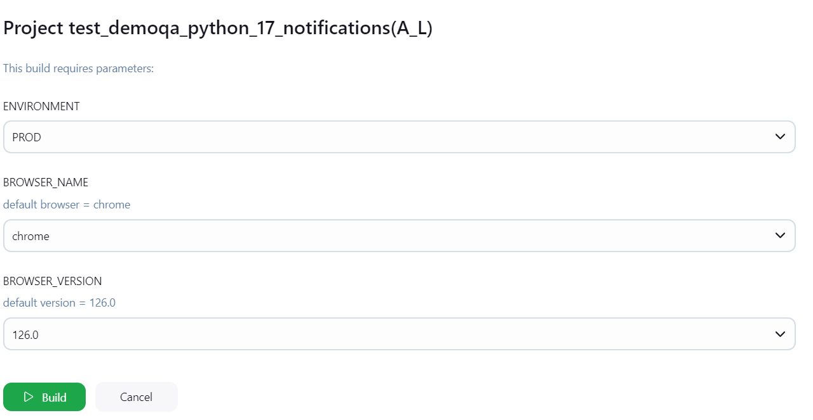
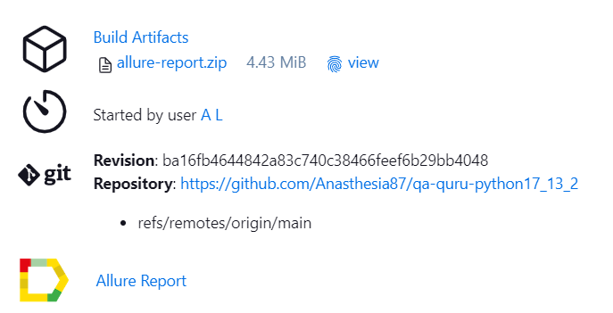
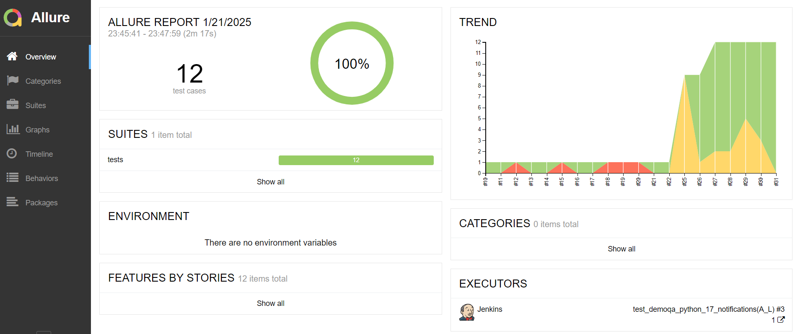
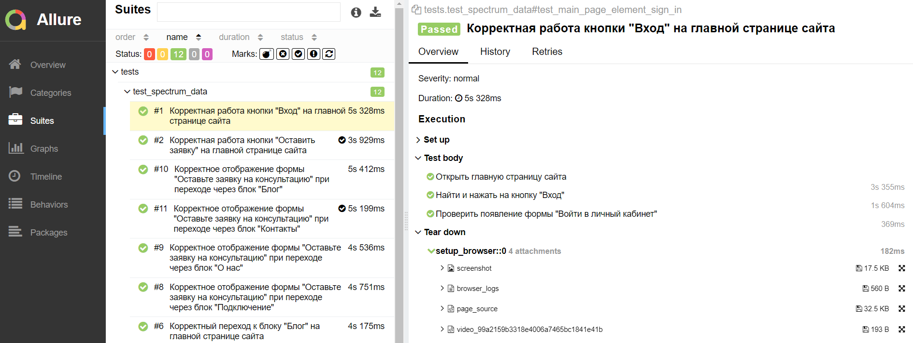

<h1 align="center">Проект автоматизации <a href="https://spectrumdata.ru">сайта</a> компании SpectrumData</h1>

### Описание:
Было разработано несколько тест-кейсов:
- [x] Проверка возможности перехода через главную страницу к разным информационным блокам
- [x] Проверка работы кнопки "Вход" на главной странице сайта
- [x] Проверка работы кнопки "Оставить заявку" на главной странице сайта
- [x] Проверка отображения формы "Оставьте заявку на консультацию" при переходе из разных информационных блоков
- [x] Проверка заполнения формы "Оставьте заявку на консультацию"

Кейсы реализованы основе шаблона PageObject

## Используемый стек технологий и инструментов
|                          Python                                |                          Pytest                                |                              Selene                              |                          Selenoid                       |                       Allure                          |                            Git                             |                           Jenkins                              |                        Telegram                        |
|:--------------------------------------------------------------:|:--------------------------------------------------------------:|:----------------------------------------------------------------:|:-------------------------------------------------------:|:-----------------------------------------------------:|:----------------------------------------------------------:|:--------------------------------------------------------------:|:------------------------------------------------------:|
|||||||||          

## Запуск автотестов
### На Jenkins реализован параметризованный запуск тестов:
```bash
python -m venv .venv
source .venv/bin/activate
pip install -r requirements.txt
pytest tests --browser_version=${BROWSER_VERSION} --browser_name=${BROWSER_NAME}
```


### Тесты выполняются на удаленном браузере благодаря использованию Selenoid
Логин и пароль для доступа к Selenoid хранятся в переменных среды
### Добавлена генерация отчетов на Allure


#### Дашборд:


### При выполнении автотестов, для тестов линкуются логи, скриншоты, html-страница и видео прохождения кейса


##### Пример видео:


          
                                                        

